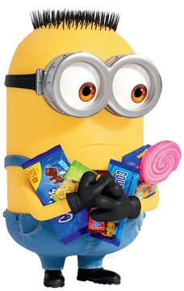

# Bello, Welcome to The Minionese Visualizer

## Purpose
This project aims to make complicated linguistic concepts fun and appealing by illustrating them through the best movie characters ever — the Minions. As many know, Minions speak a constructed language with components borrowed from Spanish, English, Hindi, Korean, and many other real-world languages. The fictional origin of their language comes from their millenia-long proximity to humans across cultures, especially villains or particular leaders such as Gru.

This project will use a combination of speech analysis software and scripting to automate the analysis of the vowels and speech patterns of Minions. The data analysis will culminate into an interactive web-based diagram showcasing the complexities of "Minionese".

## Readings 
### Could be useful [ Praat ] 
https://videoweb.nie.edu.sg/phonetic/vowels/measurements.html

https://corpus.eduhk.hk/english_pronunciation/index.php/2-2-formants-of-vowels/

https://parselmouth.readthedocs.io/en/stable/installation.html

http://phonetics.linguistics.ucla.edu/facilities/acoustic/praat.html

https://aclanthology.org/L18-1449.pdf 

https://languagelog.ldc.upenn.edu/myl/BayesianFormants.pdf

